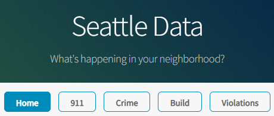
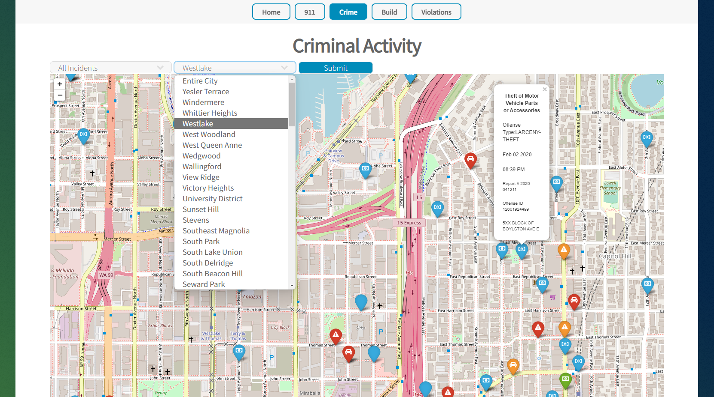
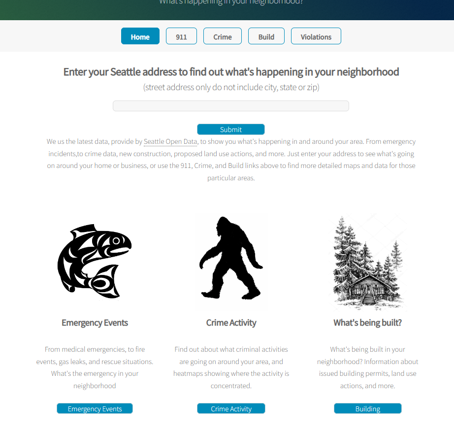
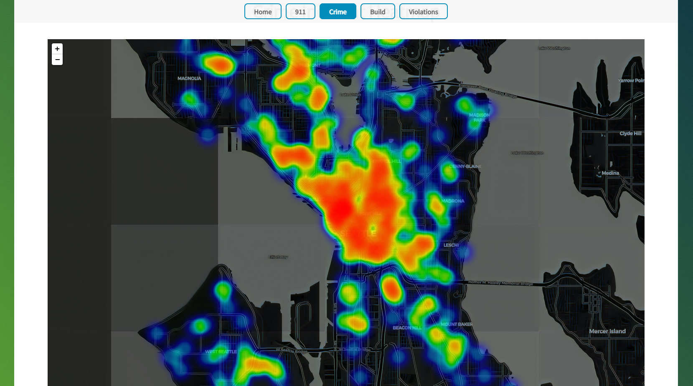
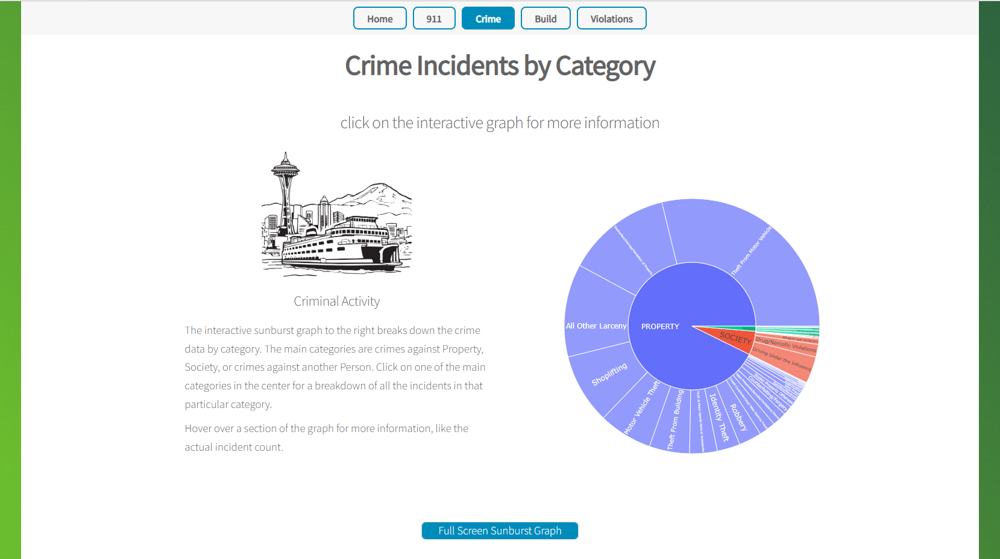

<!-- Improved compatibility of back to top link: See: https://github.com/othneildrew/Best-README-Template/pull/73 -->
<a name="readme-top"></a>

<!--
*** I'm using markdown "reference style" links for readability.
*** Reference links are enclosed in brackets [ ] instead of parentheses ( ).
*** See the bottom of this document for the declaration of the reference variables
*** for contributors-url, forks-url, etc. This is an optional, concise syntax you may use.
*** https://www.markdownguide.org/basic-syntax/#reference-style-links
-->


<!-- PROJECT LOGO -->
<br />
<div align="center">
  <a href="https://github.com/github_username/repo_name">
    
  </a>

<h3 align="center">Seattle Data</h3>

  <p align="center">
    <p>City of Seattle data maps, based on data provided by <a href="https://data.seattle.gov/">https://data.seattle.gov/</a> </p>
    <br />
    <a href="https://github.com/github_username/repo_name"><strong>Explore the docs »</strong></a>
    <br />
    <br />
    <a href="https://github.com/github_username/repo_name">View Demo</a>
    ·
    <a href="https://github.com/github_username/repo_name/issues">Report Bug</a>
    ·
    <a href="https://github.com/github_username/repo_name/issues">Request Feature</a>
  </p>
</div>


<!-- TABLE OF CONTENTS -->
<details>
  <summary>Table of Contents</summary>
  <ol>
    <li>
      <a href="#about-the-project">About The Project</a>
      <ul>
        <li><a href="#built-with">Built With</a></li>
      </ul>
    </li>
    <li>
      <a href="#getting-started">Getting Started</a>
      <ul>
        <li><a href="#prerequisites">Prerequisites</a></li>
        <li><a href="#installation">Installation</a></li>
      </ul>
    </li>
    <li><a href="#usage">Usage</a></li>
    <li><a href="#roadmap">Roadmap</a></li>
    <li><a href="#license">License</a></li>
    <li><a href="#contact">Contact</a></li>
  </ol>
</details>


<!-- ABOUT THE PROJECT -->
## About The Project
Seattle Data generates maps based on data provided by https://data.seattle.gov/
Crime and Emergency data is provided for the previous 72 hours. Other maps for things like building permits, or proposed land use 
are based on more long term data.

Written in Python on the Flask web framework, with maps generated with folium, and graphs generated with plotly
<div align="center">

</div>


<p align="right">(<a href="#readme-top">back to top</a>)</p>


### Built With

* ## <a href="https://flask.palletsprojects.com/en/2.2.x/">Flask</a>
* ## <a href="https://python-visualization.github.io/folium/">Folium</a>
* ## <a href="https://plot.ly/export/">Plotly</a>
Data provided by: https://data.seattle.gov/

<p align="right">(<a href="#readme-top">back to top</a>)</p>


<!-- GETTING STARTED -->
## Getting Started

If you would like to run it locally, a Docker container is available.
* docker
  ```sh
  docker pull noele952/seattle-data-final
  ```
  ```sh
  docker run noele952/seattle-data-final
  ```  
   

<p align="right">(<a href="#readme-top">back to top</a>)</p>


<!-- USAGE EXAMPLES -->
## Usage
<div align="center">

<p>On the landing page it has links to the four categories of mapped data
<ul style="text-align:left;">
<li>911 emergency call data</li>
<li>crime report data</li>
<li>building activity(permits, landuse, etc.)</li>
<li>code violation reports</li>
</ul>
<p>If you enter in an address it will show you maps for all four categories based on the location provided. If you click
the links instead it will load more general maps based on the category.</p>

<p>Refine your map data based on neighborhood and/or specific type of incident. Click on the incident marker to see
more information about the incident</p>

<p>View the incident data in heatmap form.</p>

<p>See the incident date broken down into an interactive "sunburst" graph.</p>

</div>

<p align="right">(<a href="#readme-top">back to top</a>)</p>


<!-- ROADMAP -->
## Roadmap

- [ ] database integration
- [ ] date selector
- [ ] user login

The next change to the app will be adding database integration, it is currently pulling all of it's data from the 
https://data.seattle.gov/ api. with database integration that will allow us to work with a larger historical dataset.
The current data available through the API goes back to 2008. 

Having that data available will allow for the next upgrade, which is adding a date selector to the map search bar,
allowing users to map historical data, not just the last 72 hour period.

The third proposed upgrade is a user login feature that will allow users to login, save their address, and sign up for
text/email notifications for selected incident types that occur within a 1 mile range.

<p align="right">(<a href="#readme-top">back to top</a>)</p>


<!-- LICENSE -->
## License

Distributed under the MIT License. See `LICENSE.txt` for more information.

<p align="right">(<a href="#readme-top">back to top</a>)</p>


<!-- CONTACT -->
## Contact

Noel Alderman - [@vintageeurocars](https://twitter.com/twitter_handle) - noele952@gmail.com

Project Link: [https://github.com/noele952/seattle-data-final](https://github.com/github_username/repo_name)

<p align="right">(<a href="#readme-top">back to top</a>)</p>


<!-- MARKDOWN LINKS & IMAGES -->
<!-- https://www.markdownguide.org/basic-syntax/#reference-style-links -->


